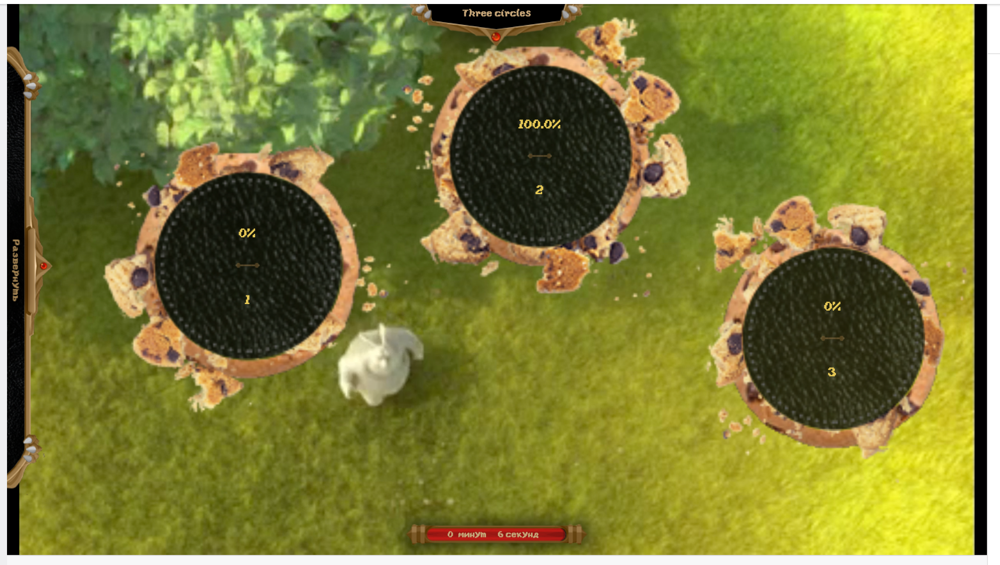

# Axe collision combat/heroes

It was an isteresting combination of three parts:
- Promo landings for two extensions
- register API for two Twitch extensions. Used 
- Twitch voting extension with drawing of variants in any place of the screen. It's better one-time see:

## Stack
- landing + register API = Vanila PHP & markup. E2E tests were written in python.
- extesion backend: NodeJS
